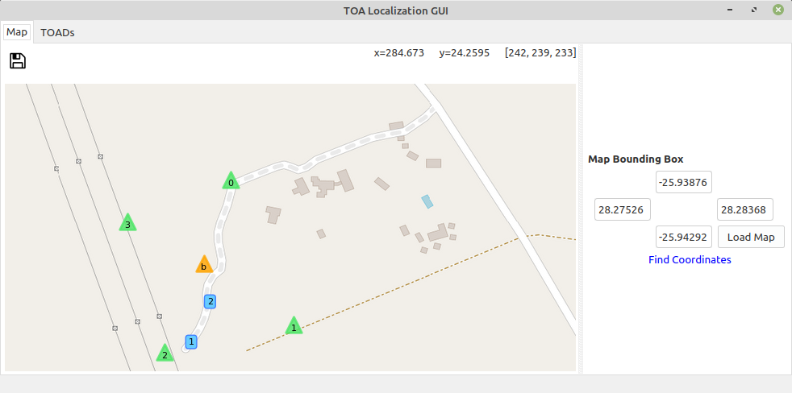

# gr-toa - GNU Radio time of arrival estimation based localization

This project contains a GNU Radio signal processing block that estimtates the
times of arrival (TOAs) of a signal emitted by a mobile tag at three or more
distributed receivers. A stationary reference transmitter at a known location
is required for time synchronization. The TOA estimates are transmitted to a
central server using ZeroMQ and the current location of the tag is then
estimated from all collected measurements. Finally the result can be displayed
on a map in the graphical user interface.

## Dependencies

- GNU Radio 3.7.13
- gr-osmosdr
- python3-numpy
- python3-pyproj
- python3-matplotlib
- python3-mpltoolkits.basemap
- python3-zmq
- python3-apsw
- python3-pyqt4
- python3-qwt
- python3-tk
- python3-apscheduler

## How to build

    mkdir build
    cd build
    cmake ../

Don't forget to set the install prefix if desired

    make

## Installation and environment variables

Note that an installation is not necessary if you want to run in the debug
environment. If you have set the install prefix and want to install then run

    sudo make install

Now let's assume for a moment that the install prefix is /opt/gr_toa. Then set
these environment variables, e.g. in your .bashrc to enable GNU Radio Companion
to find the binaries, libraries and GNU Radio Companion blocks:

    export PATH="/opt/gr_toa/bin:$PATH"
    export LD_LIBRARY_PATH="/opt/gr_toa/lib:$LD_LIBRARY_PATH"
    export PYTHONPATH="/opt/gr_toa/lib/python2.7/dist-packages:$PYTHONPATH"
    export GRC_BLOCKS_PATH="/opt/gr_toa/share/gnuradio/grc:$GRC_BLOCKS_PATH"

Alternativley to activate a debug environment and run the software without
installation, source the debugenv file in the root folder of the repository

    . debugenv

This makes it possible to run the software in the apps/ and grc/ folders.

## How to configure the system

To configure the system edit the file toa_config in the apps/ folder.

## How to run the sytem

When running with the debug environment, the python apps are located in apps/
and the GNU Radio Companion flowgraphs in grc/. On the other hand, when the
software has been installed to /opt, the python applications should be found
through the environment variables.

In the following we assume the debug environment is used. A GNU Radio Companion
containing a single debug receiver can then be opened with

    cd grc
    gnuradio-companion fsk_receiver_low_snr.grc

The full localization system requires three different types of software
components: several GNU Radio based receivers, a server and a graphical user
interface. The receivers capture the signal of a reference beacon, which is a
stationary tag, and the mobile tracking tags and estimate the times of arrival
(TOAs). Those TOAs are then send to the server over a network connection using
ZeroMQ. The server processes the measurements and estimates the locations of
the mobile tags. Those locations are send to the graphical user interface (GUI)
and displayed on a map.

To start a receiver run

    ./toa_receiver.py -i <ID>

Receiver IDs should start from 0.

A basic system consists of 4 receivers, while a 3 receiver system is also possible.

To start the server run

    ./toa_server.py

To start the GUI run

    ./toa_gui.py

At least the reference beacon, i.e. the tag with ID 0 and one mobile tag, e.g.
ID 1 should be present. If that is the case and all receivers capture a signal
from both of these tags the server will be able to calculate localization
results and they are displayed in the GUI on a map.

## Copyright and support information
Copyright © 2019 [Johannes Schmitz](mailto:johannes.schmitz1@gmail.com). Please send an email for commercial support.
